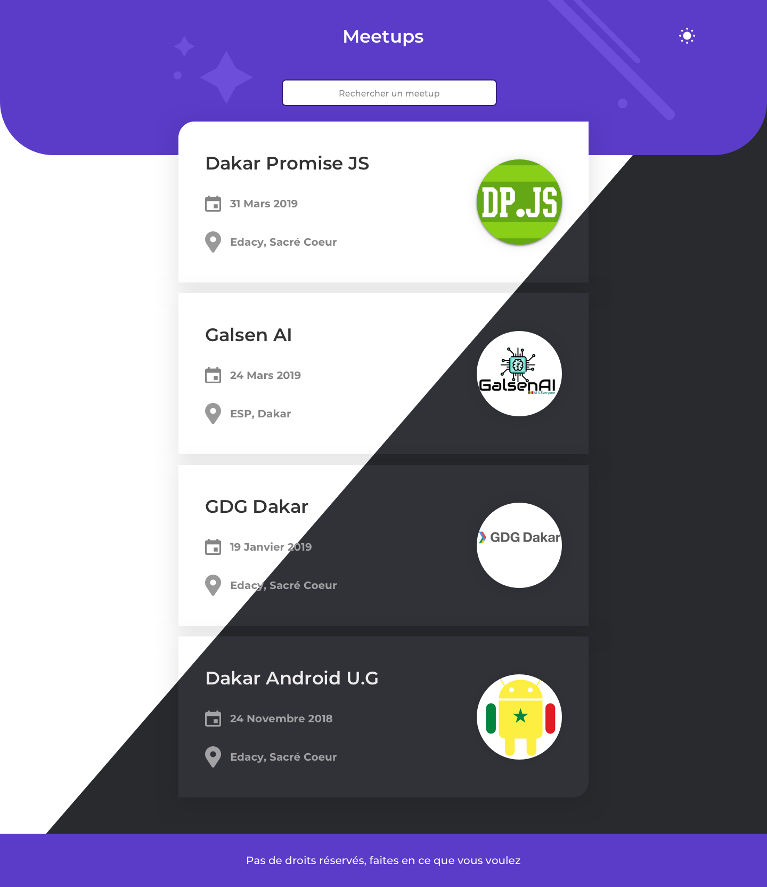

# Dakar Promise JS Meetup (03/30/19) #
HTML/CSS(SCSS) mockup of the project we gonna turn in Angular, Vue and React

 

## How to run the project ##
1. Download the project folder or clone it 
2. Open the index.html file
3. Click on the sun/moon icon on the top left corner to change theme
4. Enjoy

## Tools Used ##
- [Sketch 53.2](https://sketchapp.com) for UI Design 
- [Webstorm 2019.1](https://www.jetbrains.com/webstorm/) for development 
